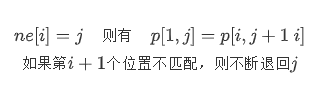

# KMP



```cpp
for(int i=2,j=0;i<=n;i++){
    while(j && p[i]!=p[j+1]) j=ne[j];
    if(p[i]==p[j+1]) j++;
    ne[i]=j;
}
//kmp匹配过程
for(int i=1,j=0;i<=m;i++){
    while(j && s[i]!=p[j+1]) j=ne[j];
    if(s[i]==p[j+1]) j++;
    if(j==n){
        //匹配成功
    }
}
```
注意可以用二维数组预处理如果i处不匹配，遇到特定字符c退回的位置