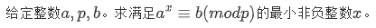

# bsgs模板


```cpp
int bsgs(int a,int b,int p){
    if(1%p == b%p) return 0;
    int k=sqrt(p)+1;
    unordered_map<int,int> hash;
    for(int i=0,j=b%p;i<k;i++){
        hash[j]=i;
        j=(ll)j*a%p;
    }
    int ak=1%p;
    for(int i=0;i<k;i++){
        ak=(ll)ak*a%p;
    }
    for(int i=1,j=ak%p;i<=k;i++){
        if(hash.count(j)) return (ll)i*k-hash[j];
        j=(ll)j*ak%p;
    }
    return -INF;
}
int exgcd(int a,int b,int &x,int &y){
    if(!b){
        x=1,y=0;
        return a;
    }
    int d=exgcd(b,a%b,y,x);
    y-=a/b*x;
    return d;
}
int exbsgs(int a,int b,int p){
    b=(b%p+p)%p;
    if(1%p==b%p) return 0;
    int x,y;
    int d=exgcd(a,p,x,y);
    if(d>1){
        if(b%d) return -INF;
        exgcd(a/d,p/d,x,y);
        return exbsgs(a,(ll)b/d*x%(p/d),p/d)+1;
    }
    return bsgs(a,b,p);
}
```