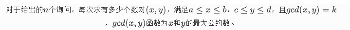

# 线性求莫比乌斯并求前缀和



``` cpp
void init(){
    mu[1]=1;
    for(int i=2;i<N-5;i++){
        if(st[i]==0) primes[cnt++]=i,mu[i]=-1;
        for(int j=0;primes[j]*i<N;j++){
            st[primes[j]*i]=true;
            if(i%primes[j]==0) break;
            mu[primes[j]*i]=-mu[i];
        }
    }
    for(int i=1;i<N;i++) sum[i]=sum[i-1]+mu[i];
}
int g(int k,int x){
    return k/(k/x);
}
ll f(int a,int b,int k){
    a=a/k,b=b/k;
    ll res=0;
    int n=min(a,b);
    for(int l=1,r;l<=n;l=r+1){
        r=min(n,min(g(a,l),g(b,l)));
        res+=(ll)(sum[r]-sum[l-1])*(a/l)*(b/l);
    }
    return res;
}
```