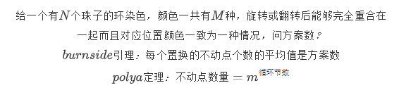

# polya定理


```cpp
typedef long long ll;
int gcd(int a,int b){
    return b?gcd(b,a%b):a;
}
ll qsm(ll a,ll b){
    ll res=1;
    while(b){
        if(b&1) res=(res*a);
        a=(a*a);
        b>>=1;
    }
    return res;
}
int  main(){
    int m,n;
    while(cin>>m>>n, m||n){
        ll res=0;
        for(int i=0;i<n;i++){
            res+=qsm(m,gcd(n,i));
        }
        if(n%2){
            res+=n*qsm(m,(n+1)/2);
        }
        else{
            res+=n/2*(qsm(m,n/2+1)+qsm(m,n/2));
        }
        cout<<res/(2*n)<<endl;
    }
    return 0;
}
```