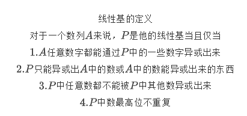

# 线性基



```cpp
//已知线性基求最大值
int findmax(ll *p, int k)
{
    sort(p+1,p+k+1,greater<int>());
    ll v=0;
    for(int i=1;i<=k;i++)
        v=max(v,v^p[i]);
    return v;
}
//求线性基
int k=0;
for(int i=62;i>=0;i--){
    for(int j=k;j<n;j++){
        if(a[j]>>i&1){
            swap(a[j],a[k]);
            break;
        }
    }
    if(!(a[k]>>i&1)) continue;
    for(int j=0;j<n;j++){
        if(j!=k && (a[j]>>i&1))
            a[j]^=a[k];
    }
    k++;
    if(k==n) break;
}

```